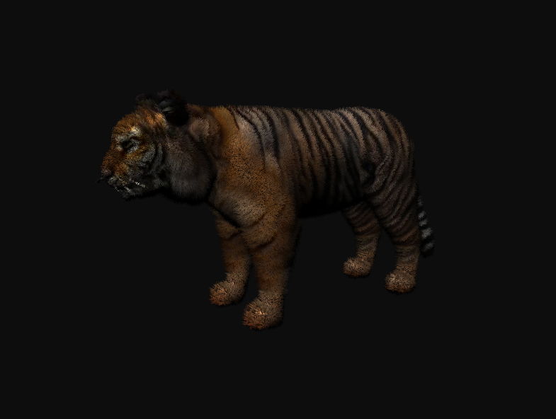
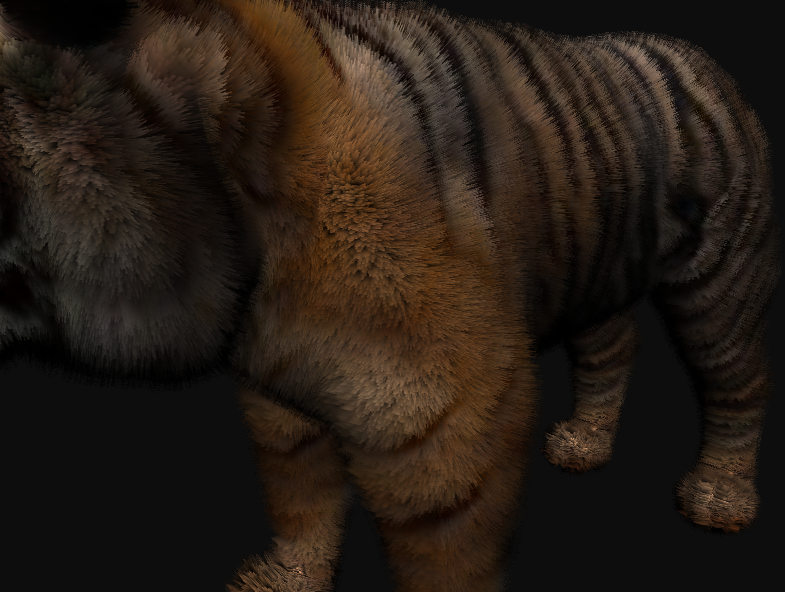

# Fur-Visualization with OpenGL

Fur-Visualization is a program that allows you to visualize fur using OpenGL and Shell-Texturing technology. It gives you the ability to visualize fur or grass in real time. The shell-Texturing method has the advantage of high productivity and the disadvantage of the difficulty of adding physic to realistically move the hairs in the fur.

# Result




# Build

This project use CMake for efficient and simple build.

In addition, different libraries are required for this project to work correctly. Namely, Assimp (for loading a 3D model), GLM (for mathematics), GLUT (included in the project), GLEW (for rendering windows and interacting with the mouse and keyboard). The easiest way to install this is using package manager like APT(in debian/ubuntu), VCPKG, Conan, but you can install it manually.

```bash
git clone <this_repo>
cd <this_repo_name>
mkdir build
cmake -S . -B build
cmake --build ./build
```
